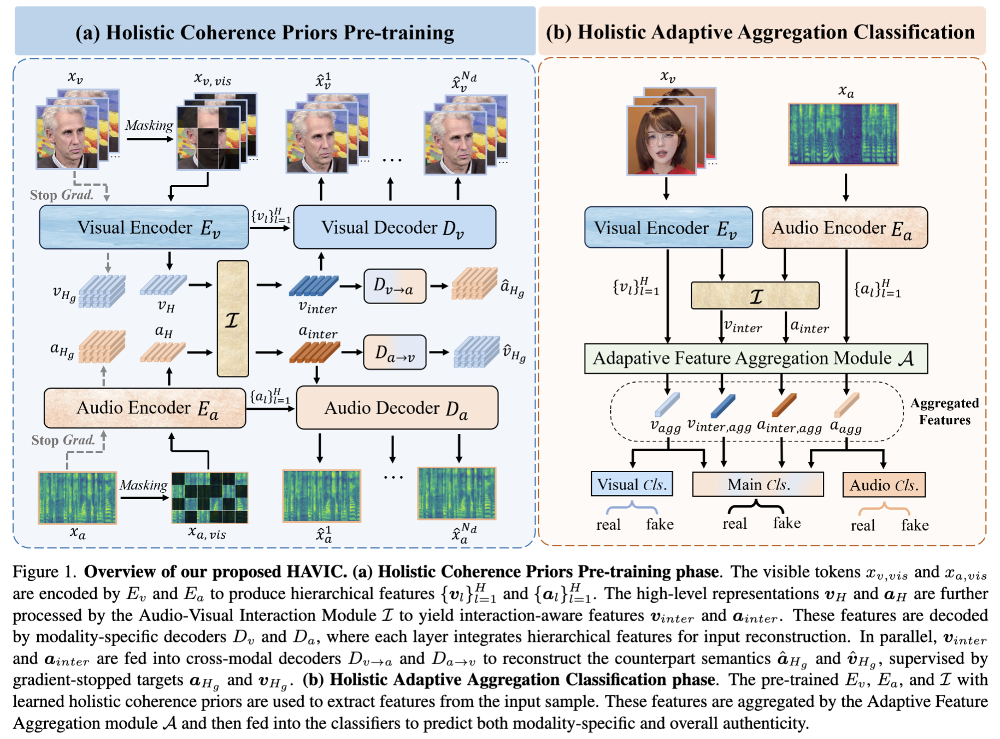

<div align="center">
  <h2><b> Leave No Stone Unturned: Uncovering Holistic Audio-Visual Intrinsic Coherence for Deepfake Detection </b></h2>
</div>

<div align="center">

</div>

<p align="center">
  <a href="https://github.com/tuffy-studio/HAVIC/">
    
  </a>
  &nbsp;&nbsp;&nbsp;
  <a href="">
    
  </a>
  &nbsp;&nbsp;&nbsp;
  <a href="https://huggingface.co/JielunPeng/HAVIC/">
    
  </a>
</p>


## Overview
This repository contains the official implementation of [Leave No Stone Unturned: Uncovering Holistic Audio-Visual Intrinsic Coherence for Deepfake Detection](#). The proposed **HiFi-AVDF** dataset is available at [here](https://huggingface.co/datasets/JielunPeng/HiFi-AVDF).



## News

- **[Dec 2025]** Pre-training, finetuning, evaluation and inference code are released.
- **[Feb 2026]** Our paper is accepted at CVPR 2026 Findings.
- **[Coming Soon]** We will release the model weights, and the HiFi-AVDF dataset ASAP. 
- **⭐ Star us** to get notified when the weights and dataset are released!

## Requirements

### 1. Create a conda environment and activate it

```bash
conda create -n HAVIC python=3.10 ffmpeg
conda activate HAVIC
```
### 2. Install Python ependencies

```bash
pip install -r requirements.txt
```

<!-- > ❗**Note:** If you are in mainland China, you can use the following commands to speed up Python package installation:

```bash
pip install -r requirements.txt -i https://mirrors.aliyun.com/pypi/simple/
``` -->


## Dataset Download

We pre-train the HAVIC on the **LRS2** dataset, which contains only real videos. Please download LRS2 at [here](https://www.robots.ox.ac.uk/~vgg/data/lip_reading/lrs2.html). Due to copyright we cannot release the data. 


We use the **FakeAVCeleb** dataset to finetune the model and evaluate intra-dataset performance. Please follow the instructions on their [official site](https://sites.google.com/view/fakeavcelebdash-lab/) to request and download the dataset.

To further evaluate the cross-dataset generalization of the model, we use **KoDF** and **HiFi-AVDF** dataset:

* **KoDF official page**: [KoDF](https://deepbrainai-research.github.io/kodf/)
* **HiFi-AVDF download page**: [HiFi-AVDF](#)


## Training

### Pre-training

#### Step 1: Data Preprocessing
We perform preprocessing on LRS2 dataset to crop the face regions:
```bash
# Make sure you are in the project root directory.
cd ./video_data_engine/
python preprocess_pt_dataset.py \
    --training_set_root <path to the training set root> \
    --test_set_root <path to the test set root>
```
This step produces two CSV files containing the preprocessed data for training and testing: `processed_pt_training_set.csv` and `processed_ft_test_set.csv`. Each file contains five columns: `video_path, face_crop_folder, audio_label, visual_label, overall_label`. The labels will not be used.


#### Step 2: Initialize Weights for Pretraining

Following [AVFF](https://openaccess.thecvf.com/content/CVPR2024/html/Oorloff_AVFF_Audio-Visual_Feature_Fusion_for_Video_Deepfake_Detection_CVPR_2024_paper.html), We initialize the audio and visual encoder–decoders separately with the pretrained weights of **AudioMAE** and **MARLIN**. 
Please download the official pretrained [AudioMAE](https://drive.google.com/file/d/1ni_DV4dRf7GxM8k-Eirx71WP9Gg89wwu/view?usp=share_link) and [MARLIN](https://huggingface.co/ControlNet/MARLIN/blob/main/marlin_vit_base_ytf.full.pt) model weights and place them in the `weights/` folder. Then Run the following to get init weights:

```bash
# Make sure you are in the project root directory.
cd ./weights/
python initialize_pretrain_weights.py
```

This step will generate a `model_to_be_pt.pth` file, which contains the initialized model weights for pre-training.

#### Step 3: Start Pre-training

After the above steps, you can start the pre-training process by running the following command. Note that you need to configure several settings in the shell script `pretrain.sh` in advance, including the path of  **model saving directory**, etc.
```bash
# Make sure you are in the project root directory.
cd ./scripts/
bash pretrain.sh
```

**The pre-trained model weights are provided at [here](https://huggingface.co/JielunPeng/HAVIC/).**

> Additionally, since our pre-training method incorporates the **Masked Autoencoders (MAE)** to learn self-supervised representations, we implemented visualizations of the masked regions and the reconstructed outputs in [MAE_visualization.py](./MAE_visualization.py). Before running, make sure to configure the necessary settings in the shell script [mae_visual.sh](./mae_visual.sh).

---

### Finetuning

#### Step 1: Data Preprocessing

First, we randomly split the FakeAVCeleb dataset into **70% training** and **30% test** sets by running the following command:

```bash
# Make sure you are in the project root directory.
cd ./video_data_engine/
python split_FakeAVCeleb_dataset.py \
    --dataset_root <path to dataset root, e.g., /data/FakeAVCeleb_v1.2>
```
This will produce two CSV files under the `video_data_engine` directory: `training_set.csv` for the training split and `test_set.csv` for the test split. Each CSV file contains four columns:
`
video_path, audio_label, visual_label, overall_label
`
. The labels are automatically inferred from the video path.

Then, we perform preprocessing on the two splits to crop the face regions:

```bash
# Make sure you are in the project root directory.
cd ./video_data_engine/
python preprocess_ft_dataset.py \
    --training_set_csv <path to the training_set.csv file> \
    --test_set_csv <path to the test_set.csv file>
```
This step produces two new CSV files containing the preprocessed data for training and testing: `processed_training_set.csv` and `processed_test_set.csv`. Each file contains five columns: `video_path, face_crop_folder, audio_label, visual_label, overall_label`.

#### Step 2: Initialize Weights for Finetuning

After pre-training, the pre-trained weights need to be transferred to be loaded into the model for finetuning. Please put the pre-trained weights or the weights downloaded from our release into the `./weights` directory, then run the following command to obtain the initial weights for finetuning:

```bash
# Make sure you are in the project root directory.
python ./weights/pt2ft.py
```
This step will generate a `model_to_be_ft.pth` file, which contains the initialized model weights for finetuning, and a `newly_added_modules.txt` file, which is a list recording the newly added modules that will be trained at a larger learning rate during the finetuning stage.

#### Step 3: Start Finetuning

After the above steps, you can start the finetuning process by running the following command. Note that you need to configure several settings in the shell script `finetune.sh` in advance, including the path of  **model saving directory**, etc.
```bash
# Make sure you are in the project root directory.
cd ./scripts/
bash finetune.sh
```


**The finetuned model weights are also provided at [here](https://huggingface.co/JielunPeng/HAVIC/).** 

## Evaluation and Inference
Before evaluation or inference, please prepare your fine-tuned model, or download the model provided by us.

To evaluate or run inference on videos, please first organize the input videos into a CSV file. You may use [our provided code](evaluation/make_label_csv.py) or prepare the CSV using your own method.

For evaluation, the CSV file should contain two columns: `video_path, overall_label`, where `video_path` is the absolute path to the video file, and `overall_label` indicates the ground-truth label of the sample. For inference, the CSV file should contain a single column: `video_path`.


>❗**Note:** No additional video pre-processing is required, as the entire video will be automatically processed using a sliding-window strategy during evaluation and inference, and the face detection module from FaceX-Zoo is integrated into the pipeline. During execution, a temporary directory named sliding_window_inference_tmp will be created in the current working directory to store intermediate files.

Then you can run evaluation or inference using the following commands:

```bash
# Make sure you are in the project root directory.
cd ./evaluation/
python sliding_window_infer.py \
    --csv_file_path <path_to_input_csv> \
    --save_csv_path <path_to_output_csv> \
    --finetune_path <path_to_finetune_weight> \
    --mode <evalution or inference>
```

For each input video, the model outputs a deepfake probability score, indicating the likelihood that the video is manipulated (1:fake; 0:real). The prediction results will be saved to  `save_csv_path`, where each row contains a video path, the ground-truth label (if in evaluation mode), and predicted probability.


## Acknowledgement

We appreciate the following github repos for their valuable code and contributions:

- MARLIN (https://github.com/ControlNet/MARLIN)
- AudioMAE (https://github.com/facebookresearch/AudioMAE)
- OpenAVFF (https://github.com/JoeLeelyf/OpenAVFF)
- FaceX-Zoo (https://github.com/JDAI-CV/faceX-Zoo)


## Contact

If you have any questions or concerns, please contact:

📧 **[jielunpeng.hit@gmail.com](mailto:jielunpeng.hit@gmail.com)**

📧 **[25s003052@stu.hit.edu.cn](25s003052@stu.hit.edu.cn)**

or feel free to submit an issue in this repository.
